#  Sistema de Gestión de Citas para el Servicio de Identificación en Angola (Provincia de Bengo)  
El sistema fue desarrollado con el fin de modernizar los procesos administrativos en el servicio de identificación de la provincia de Bengo, Angola, contribuyendo a la **transformación digital** del sector público.  

---

##  Marco Teórico y Contexto

En muchos países, los servicios de identificación funcionan de manera manual, generando largas filas, procesos lentos, baja eficiencia y malestar ciudadano.  
La digitalización de procesos administrativos, como la gestión de citas, constituye una solución efectiva para:  

- Reducir tiempos de espera.  
- Optimizar la organización interna.  
- Mejorar la experiencia de atención al ciudadano.  
- Aumentar la transparencia institucional.  

Este contexto motivó el diseño e implementación de un sistema digital de gestión de citas que permita agilizar la atención en el servicio de identificación de Angola.  

---
## Modelo de Dominio
A continuación, se muestra la documetanción fudamental para compreder el sistema de gestión de Citas.
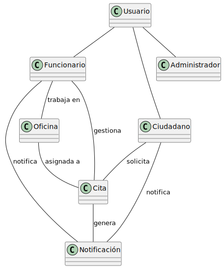

## Diagramas de estados:
## Diagramas de estado cita:
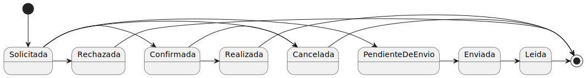
## Diagramas de estado Notificación:
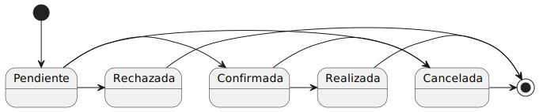

## Actores y Casos de Uso :
El sistema cuenta con 3 actores: ciudadano, funcionario y administrador, cada un tiene su rol y funcionalidad.

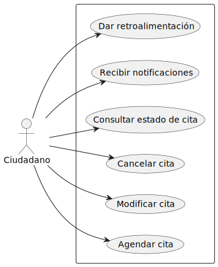
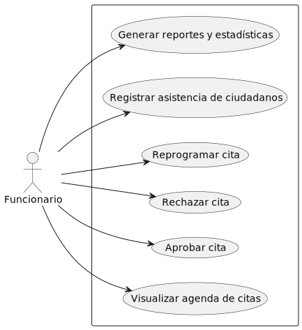
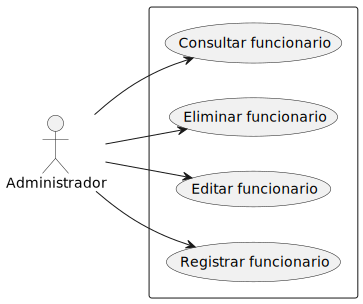

## Diagrama de contexto:

## Diagrama de contexto del caso de uso ver estado de la cita:

## Diagrama de contexto del caso de uso funcionario:

## Diagrama de contexto del caso de uso administrador:

## Detalle de casos de uso:
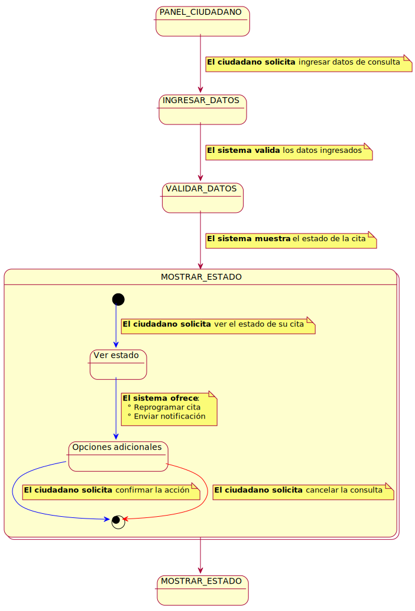

## Interfaz de usuario propuestas:
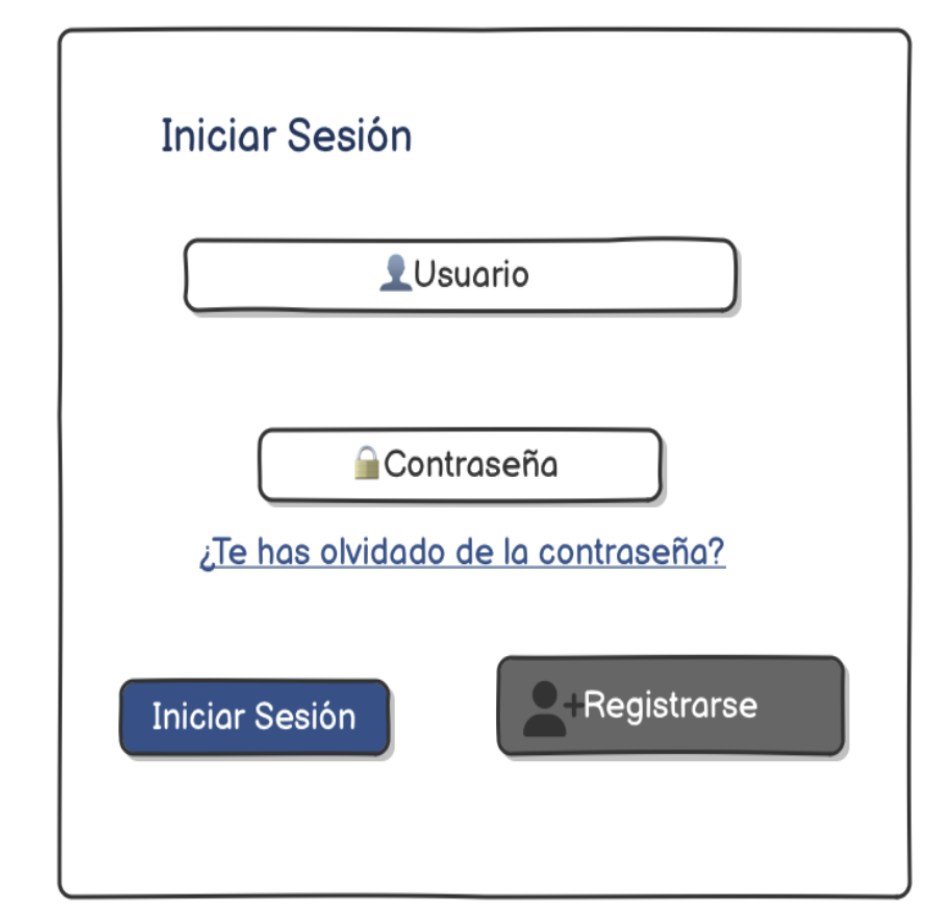
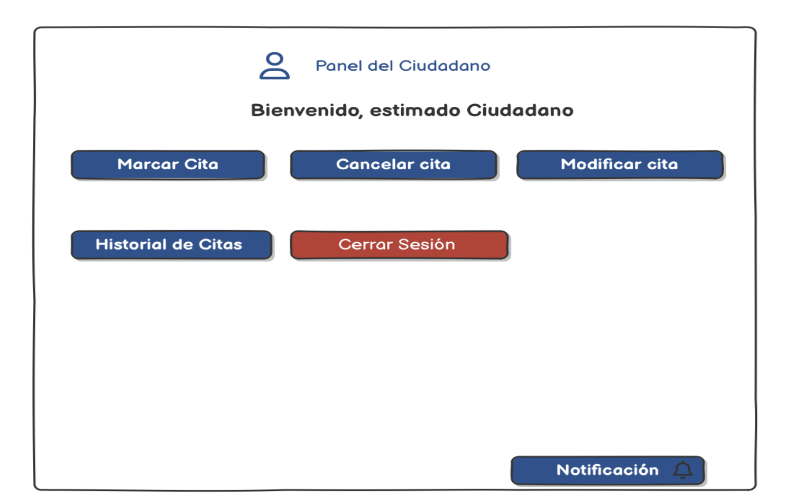

**Modelo MVC**  
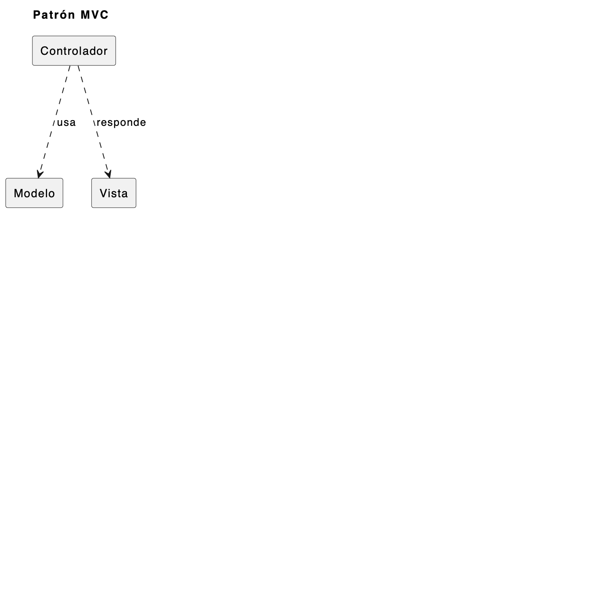
**Capa de Presentación del Sistema**  
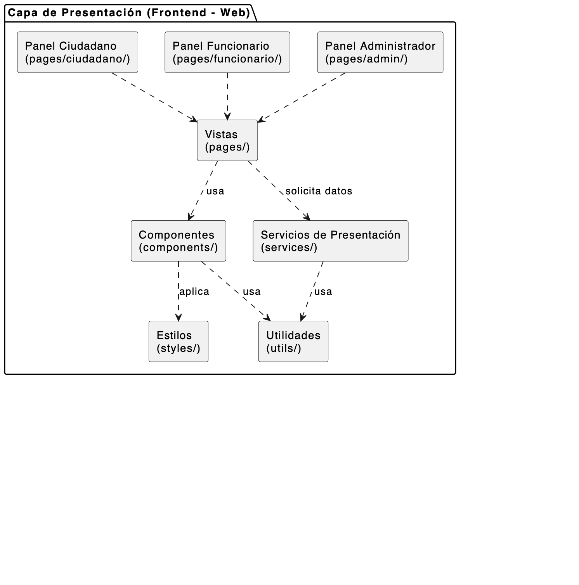
**Capa de Negocios (Node.js - Express)**  
.png)

## Diseño:
## Tecnologías Empleadas

| Categoría      | Tecnología       | Descripción breve |
|----------------|-----------------|-------------------|
| Backend        | Node.js         | Entorno de ejecución JavaScript del lado del servidor |
| Backend        | Express.js      | Framework minimalista para construir APIs REST |
| Base de datos  | MYSQL           | Sistema de gestión de bases de datos relacional |
| Contenedores   | Docker          | Contenedores para backend, frontend y base de datos |
| Orquestación   | docker-compose  | Orquestación de servicios Docker |
| Despliegue     | DigitalOcean    | Plataforma de despliegue en la nube |
| Dominio propio | muenho.es       | Dominio personalizado configurado donDominio |
| Frontend | css,html,javaScript   | tecnologias resposables por la parte visual de sistema |

## 📖 Glosario

👉 [Ver Glosario Completo](./Documentacion/Glosario.md)
## Recursos y Materiales de Apoyo

Durante el desarrollo del sistema de gestión de citas se consultaron diversos materiales de apoyo que sirvieron como referencia técnica y conceptual:

- **Documentación oficial**
  - [Node.js](https://nodejs.org/en/docs/) – Documentación del entorno de ejecución.
  - [Express.js](https://expressjs.com/) – Framework para el desarrollo de APIs REST.
  - [MySQL](https://dev.mysql.com/doc/) – Documentación oficial del sistema de bases de datos.
  - [JWT](https://jwt.io/introduction/) – Conceptos y uso de JSON Web Tokens para autenticación.
  - [bcrypt](https://www.npmjs.com/package/bcrypt) – Librería para el cifrado de contraseñas.

-  **Artículos y estudios**
  - Organización de las Naciones Unidas (2022). *E-Government Survey 2022*.
  - Janssen, M., & Van der Voort, H. (2016). *Adaptive governance: Towards a stable, accountable, and responsive government.*
  - Ferreira, M. et al. (2021). *Digital Divide in Angola: Challenges for Public Services.*

-  **Repositorios académicos de referencia**
  - [Repositorio IdSw – Manuel Masías](https://github.com/mmasias/idSw)  
  - [Repositorio 24-25-IdSw1-SDR – Celia Becerril](https://github.com/celiabecerril/24-25-IdSw1-SDR)

-  **Material complementario**
  - Tutoriales en línea sobre APIs REST con Node.js y Express.
  - Guías de diseño de bases de datos relacionales con MySQL.
  - Recursos de accesibilidad web (WCAG) para mejorar la usabilidad en usuarios con baja alfabetización digital.

## Solución:

  
## Conclusión
- Se logrará digitalizar un proceso crítico para el ciudadano angoleño.
- Se reducirá tiempos de espera y se mejora la gestión interna.
- El sistema sientará bases para la futura modernización de otros procesos públicos.
